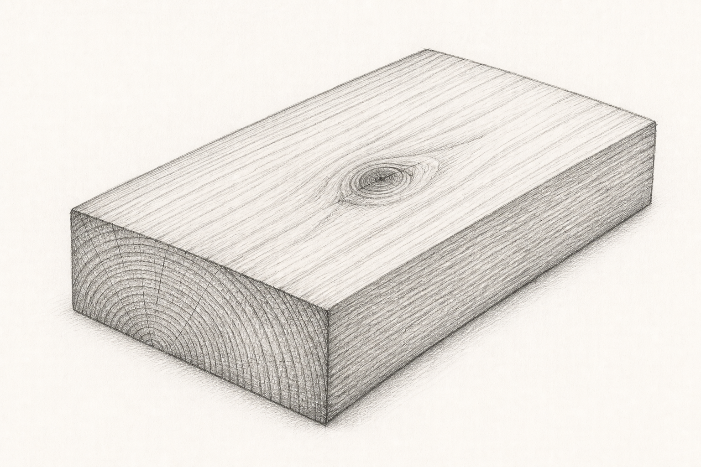
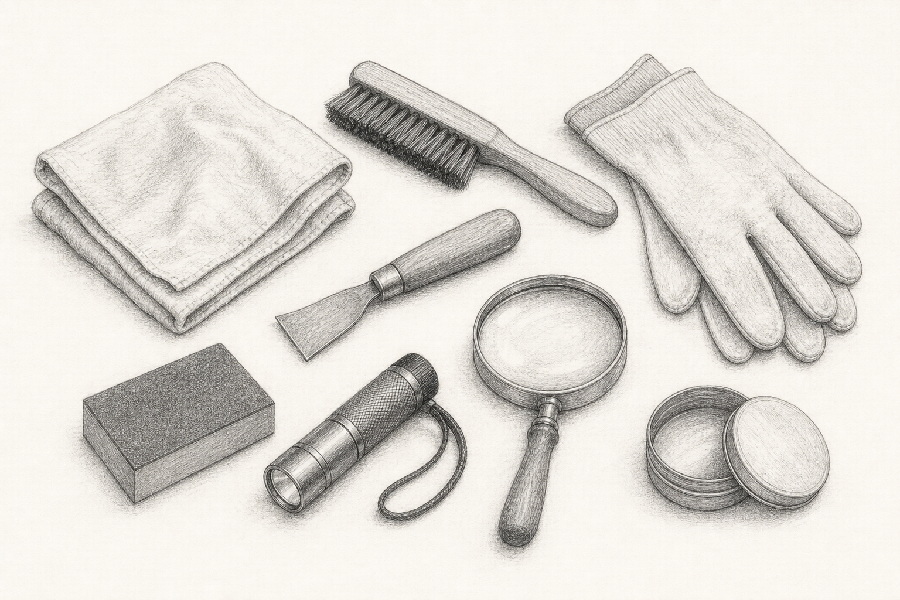
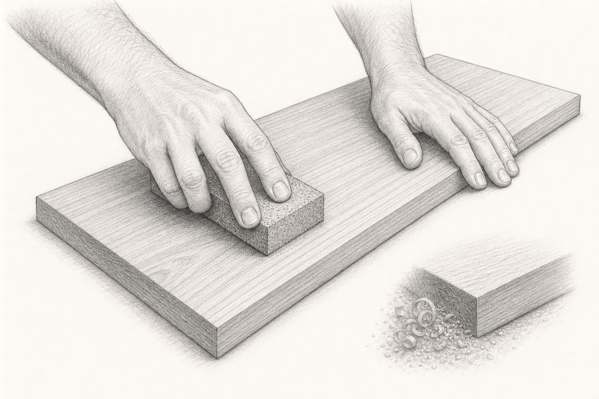
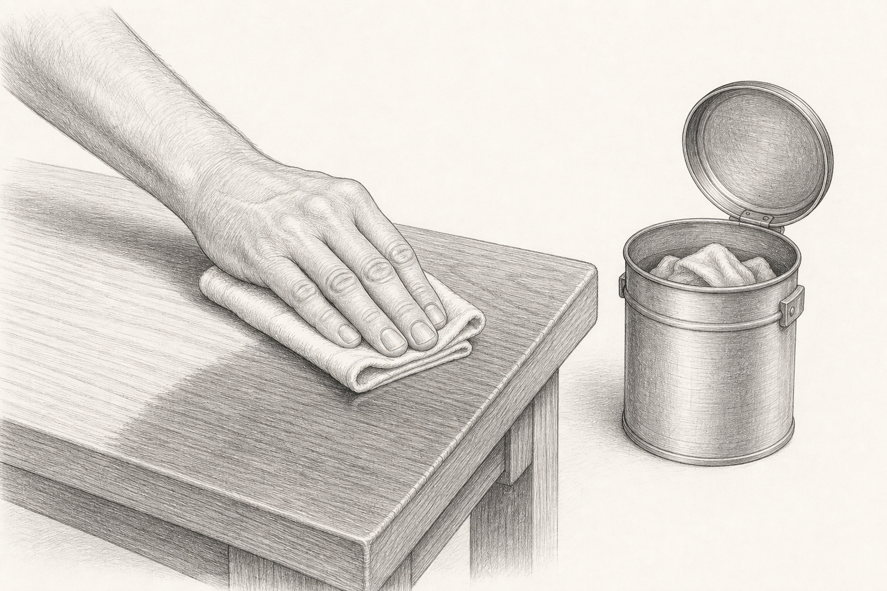
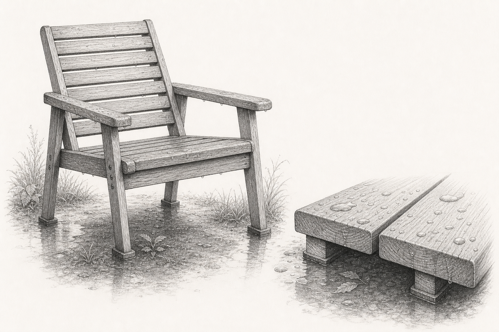

# Holzpflege leicht gemacht

## Holz verstehen, Oberflächen erhalten, Schäden sicher beheben

Praxisbuch für Möbel, Böden, Küchenholz und Außenbereiche

Thomas Frenzel

Erste digitale Ausgabe, Juli 2026

---

## Impressum

Titel: *Holzpflege leicht gemacht*

Untertitel: *Holz verstehen, Oberflächen erhalten, Schäden sicher beheben*

Ausgabe: Erste digitale Ausgabe, Juli 2026

Autor und Herausgeber: Thomas Frenzel  
Anschrift: Hohenstaufenstr. 12, 71032 Böblingen  
Telefon: +49 170 9980942  
E-Mail: info@tf-m.de  
Website: www.tf-m.de  
Text und Redaktion: Thomas Frenzel  
Gestaltung und Satz: Projektfassung im Auftrag erstellt  
Illustrationen: KI-gestützte Bleistiftzeichnungen, redaktionell ausgewählt und eingebunden  
Herstellung: Digitale Ausgabe

Copyright © 2026 Thomas Frenzel. Alle Rechte vorbehalten. Die Vervielfältigung oder Weitergabe außerhalb der gesetzlichen Schranken bedarf der Zustimmung des Rechteinhabers.

## Sicherheits- und Haftungshinweis

Dieses Buch vermittelt allgemeine handwerkliche Grundlagen. Produktetikett, technisches Merkblatt und Sicherheitsdatenblatt des verwendeten Mittels haben immer Vorrang. Für lösemittelhaltige Produkte, Abbeizer, Holzschutzmittel, Schleifstäube und schimmelbelastete Flächen gelten besondere Schutzmaßnahmen. Bei tragenden Bauteilen, starkem Pilz- oder Insektenbefall, historischen Oberflächen, unbekannten Altbeschichtungen oder gesundheitlichen Beschwerden ist Fachhilfe nötig.

Ölgetränkte Lappen können sich durch Wärmeentwicklung selbst entzünden. Nach Gebrauch flach und einzeln im Freien trocknen lassen, sofern der Produkthersteller dies erlaubt, oder in einem dicht schließenden, nicht brennbaren Metallbehälter nach örtlichen Vorgaben sammeln und entsorgen. Nie zerknüllt liegen lassen.

---

# Vorwort

Holz altert sichtbar. Licht verändert seine Farbe, trockene Luft öffnet Fugen, Wasser stellt Fasern auf und tägliche Berührung poliert manche Stellen, während andere matt werden. Das ist kein Versagen des Materials. Es ist die normale Reaktion eines gewachsenen Werkstoffs auf seine Umgebung.

Gute Holzpflege beginnt deshalb nicht mit einer Dose, sondern mit einer Beobachtung: Welches Holz liegt vor? Welche Oberfläche schützt es? Woher kommt der Schaden? Was soll das Stück im Alltag aushalten? Wer diese Fragen beantwortet, arbeitet sparsamer, sicherer und meist mit besserem Ergebnis.

Dieses Buch führt von der Diagnose über Reinigung und Reparatur bis zur passenden Oberflächenbehandlung. Es richtet sich an Einsteigerinnen und Einsteiger, bleibt aber präzise genug für anspruchsvolle Projekte. Die Kapitel sind bewusst kurz. Jedes vermittelt eine Entscheidung, einen Arbeitsablauf oder ein typisches Fehlerbild. Kleine Probeflächen, dünne Schichten und Geduld sind dabei wichtiger als Kraft.

## So benutzt du dieses Buch

Lies für ein konkretes Projekt zuerst Kapitel 5 bis 9. Dort entsteht der Befund. Wähle danach das passende Verfahren in den Kapiteln 15 bis 27. Die Kapitel 28 bis 31 helfen bei Wartung, Fehlern und vollständigen Projekten. Kapitel 32 fasst den sicheren Arbeitsweg zusammen.

Die Angaben zu Trockenzeiten, Reichweite und Eignung bleiben absichtlich produktneutral. Sie unterscheiden sich je nach Rezeptur, Holz, Temperatur, Luftfeuchte und Schichtdicke. Verbindlich sind die Herstellerangaben des konkret verwendeten Produkts.

---

# Inhaltsverzeichnis

## Teil I - Holz richtig lesen

1. Holzpflege beginnt mit Verstehen  
2. Aufbau, Faser und Maserung  
3. Holzarten erkennen und einordnen  
4. Feuchte, Klima und Holzbewegung  
5. Oberfläche und Zustand bestimmen  
6. Innen oder außen: zwei Belastungswelten

## Teil II - Vorbereitung und Reparatur

7. Arbeitsplatz, Werkzeug und Schutz  
8. Schonend reinigen  
9. Probeflächen und Diagnose  
10. Richtig schleifen  
11. Ziehklinge, Hobel und Bürste  
12. Dellen, Risse und lose Verbindungen  
13. Flecken, Ränder und Verfärbungen  
14. Farbe vorbereiten und angleichen

## Teil III - Oberflächen aufbauen

15. Öle  
16. Hartwachsöle  
17. Wachse  
18. Lacke und Lasuren  
19. Beizen und Farbstoffe  
20. Seife, Lauge und traditionelle Systeme  
21. Schneidebretter und Lebensmittelkontakt  
22. Dielen, Parkett und Treppen  
23. Möbel und Innenausbau  
24. Küche und Bad  
25. Gartenmöbel  
26. Terrassen, Zäune und Sichtschutz  
27. Türen, Fenster und Fassadenholz

## Teil IV - Erhalten und sicher entscheiden

28. Wartungspläne  
29. Fehlerbilder korrigieren  
30. Nachhaltig pflegen  
31. Drei vollständige Praxisprojekte  
32. Schlusskapitel: der ruhige Arbeitsweg

---

# Teil I - Holz richtig lesen

# 1. Holzpflege beginnt mit Verstehen

Pflege soll eine vorhandene Oberfläche erhalten. Renovierung stellt eine abgenutzte Schutzschicht wieder her. Restaurierung greift in ein historisches oder gestalterisch wertvolles Objekt ein und verlangt oft Spezialwissen. Diese Begriffe trennen zu können verhindert, dass eine harmlose Reinigung zur unnötigen Komplettbearbeitung wird.

Beginne mit dem Nutzungsziel. Ein Esstisch braucht Widerstand gegen Wasser, Wärme und Abrieb. Eine Schrankseite wird fast nur berührt. Eine Gartenbank muss Regen, UV-Licht und wechselnde Feuchte verkraften. Dasselbe Mittel kann auf allen drei Flächen technisch haften und trotzdem nur für eine sinnvoll sein.

Pflege folgt vier Grundsätzen:

- Ursache vor Symptom: Erst Leck, Kondensat oder scheuernde Nutzung beseitigen, dann die Oberfläche reparieren.
- Mild vor stark: Trocken reinigen, dann feucht, dann erst schleifen oder chemisch lösen.
- Klein vor groß: Jede unbekannte Kombination an verdeckter Stelle prüfen.
- Dünn vor dick: Mehr Material ergibt selten mehr Schutz. Überschuss bleibt klebrig, fleckig oder weich.

Dokumentiere den Ausgangszustand mit Fotos bei seitlichem Licht. Notiere lose Stellen, Flecken, Glanzunterschiede und Geruch. Ein solches Protokoll ist besonders hilfreich, wenn ein Projekt mehrere Tage dauert oder verschiedene Mittel getestet werden.

Ein gutes Ergebnis ist nicht zwingend neuwertig. Gebrauchsspuren können zu einem Möbel gehören. Ziel ist eine saubere, stabile, angenehm nutzbare Oberfläche, deren Charakter erhalten bleibt.

# 2. Aufbau, Faser und Maserung

Holz besteht aus länglichen Zellen. Ihre Ausrichtung bildet die Faser. Auf der Längsfläche verlaufen Poren und Strukturen überwiegend in Brettlängsrichtung; auf der Stirnfläche enden die Zellen offen. Stirnholz saugt Flüssigkeit deshalb schneller auf und braucht besondere Aufmerksamkeit.

Jahrringe entstehen durch unterschiedlich aufgebautes Früh- und Spätholz. Bei ringporigen Hölzern wie Eiche oder Esche sind die Porenreihen deutlich. Zerstreutporige Hölzer wie Ahorn, Birke oder Buche wirken gleichmäßiger. Äste lenken den Faserverlauf um. Dort reißen Schleifpapier, Hobel oder Ziehklinge leichter Fasern aus.

Maserung beschreibt das sichtbare Bild. Faserverlauf beschreibt die tatsächliche Richtung des Materials. Beide können voneinander abweichen. Streiche mit den Fingerspitzen in beide Richtungen über eine rohe Fläche: In Faserrichtung fühlt sie sich glatter an, gegen die Faser rauer.

*Abb. 1: Drei Ansichten eines Brettes. Stirnholz nimmt Flüssigkeit besonders schnell auf.*

Für Pflegearbeiten folgen daraus drei Regeln: Reinige und schleife möglichst mit der Faser. Sättige Stirnholz kontrolliert, statt es unbemerkt mehr Produkt aufnehmen zu lassen. Beurteile Farbproben auf derselben Schnittfläche und mit derselben Vorbereitung wie das Werkstück.

Furnier ist eine dünne Echtholzschicht auf einem Träger. Es zeigt echte Maserung, darf aber nur sehr vorsichtig geschliffen werden. Durchschliff legt den Träger frei und lässt sich kaum unsichtbar reparieren.

# 3. Holzarten erkennen und einordnen

Eine sichere Holzartenbestimmung ist ohne Erfahrung nicht immer möglich. Farbe allein täuscht: Licht, Beize, Alter und Oberflächenmittel verändern sie. Aussagekräftiger sind Porenbild, Gewicht, Härte, Geruch des frischen Schliffs, typische Äste und die Konstruktion.

Für die Pflege genügt oft eine Werkstoffgruppe:

- Offenporige Hölzer wie Eiche, Esche oder Nussbaum nehmen Pigmente in Poren und Frühholz unterschiedlich auf.
- Feinporige Hölzer wie Ahorn, Birke oder Buche zeigen Schleiffehler und Flecken schnell.
- Harzreiche Nadelhölzer wie Kiefer, Fichte oder Lärche können Harz ausscheiden und ungleichmäßig beizen.
- Tropische oder sehr ölreiche Hölzer können Trocknung und Haftung bestimmter Beschichtungen bremsen.
- Thermisch behandeltes Holz ist dimensionsstabiler, kann aber spröder sein und seine Farbe im Freien ebenfalls verlieren.

Bei unbekanntem Holz entscheide konservativ. Reinige mild, schleife sparsam und teste das gesamte System. Für Beschichtungen ist die Verträglichkeit mit vorhandenen Altanstrichen oft wichtiger als die exakte Art.

Massivholz erkennt man häufig an fortgesetzter Maserung über Kanten und Stirnseiten. Furnier kann an wiederholten Bildern oder einer dünnen Deckschicht erkennbar sein. Dekorfolie und Schichtstoff besitzen keine echte Faser; klassische Holzöle gehören dort nicht hin.

Holzstaub kann reizen oder sensibilisieren. Absaugung und passender Atemschutz sind unabhängig von der Holzart vernünftig. Bei unbekannten Altobjekten zusätzlich mit möglichen alten Lacken, Beizen oder Holzschutzmitteln rechnen.

# 4. Feuchte, Klima und Holzbewegung

Holz nimmt Wasserdampf aus der Luft auf und gibt ihn wieder ab. Dabei ändert es seine Maße quer zur Faser deutlich stärker als längs. Tischplatten werden im feuchten Sommer etwas breiter und in trockener Heizluft schmaler. Konstruktionen müssen diese Bewegung erlauben.

Typische Folgen ungünstigen Klimas sind offene Fugen, klemmende Schubladen, gewölbte Bretter, Risse an starr verschraubten Platten und gelöste Furnierkanten. Oberflächenbehandlungen verlangsamen den Feuchteaustausch, stoppen ihn aber nicht vollständig.

Für Innenräume hilft ein möglichst gleichmäßiges, für Menschen angenehmes Klima. Extreme Sprünge sind problematischer als kleine saisonale Veränderungen. Möbel nicht direkt an Heizquellen stellen. Wasser unter Blumentöpfen, Geräten und nassen Textilien sofort entfernen. Untersetzer brauchen eine trockene, belüftete Unterseite.

Im Außenbereich ist konstruktiver Holzschutz entscheidend: Wasser muss ablaufen, Hirnholz darf nicht dauerhaft nass stehen, Verbindungen sollen trocknen können und Bodenabstand verhindert ständige Feuchte. Eine Beschichtung kann schlechte Konstruktion nicht dauerhaft ausgleichen.

Vor Beschichtungen muss Holz ausreichend trocken und das Wetter passend sein. Verlasse dich nicht allein auf die Oberfläche. Nach Regen kann sie trocken wirken, während tiefere Zonen noch feucht sind. Ein geeignetes Messgerät liefert Vergleichswerte; entscheidend bleiben Produktangaben und stabile Bedingungen während Trocknung und Aushärtung.

# 5. Oberfläche und Zustand bestimmen

Die vorhandene Oberfläche bestimmt, was als Nächstes möglich ist. Öl zieht überwiegend ein und lässt die Maserung direkt wirken. Wachs bildet eine dünne, polierbare Schicht. Lack erzeugt einen zusammenhängenden Film. Lasuren können einen Film bilden oder offenporiger bleiben. Seifenoberflächen wirken sehr matt und müssen regelmäßig erneuert werden.

Prüfe in dieser Reihenfolge:

1. Seitliches Licht zeigt Kratzer, matte Zonen, Läufer und abblätternde Kanten.
2. Ein weißes Tuch zeigt abfärbenden Schmutz oder lose Pigmente.
3. Ein winziger Wassertropfen an verdeckter Stelle zeigt, ob Wasser schnell einzieht oder abperlt. Sofort wieder aufnehmen.
4. Ein vorsichtiger Kratztest mit dem Fingernagel an unsichtbarer Stelle zeigt weiche oder lose Schichten.
5. Geruch, Klebrigkeit und Reaktion auf Wärme können auf nicht ausgehärtete oder ungeeignete Produkte hinweisen.

Wasserflecken sitzen nicht immer im Holz. Weiße Ringe in einer Filmoberfläche können eingeschlossene Feuchte sein. Dunkle Verfärbungen in gerbstoffreichem Holz entstehen oft durch Eisen und Feuchte. Graue Außenflächen sind häufig nur UV-verwittert; weiche, faserige oder würfelig zerfallende Bereiche weisen dagegen auf tieferen Schaden hin.

Ist die Schicht fest, reicht oft Reinigung und Pflege. Ist sie lokal verschlissen, kann eine Teilrenovierung funktionieren. Blättert sie großflächig, ist ein tragfähiger Neuaufbau nötig.

# 6. Innen oder außen: zwei Belastungswelten

Innenflächen leiden vor allem unter Abrieb, Reinigungsmitteln, Flüssigkeiten, Fett, Hitze und trockener Luft. Außenflächen erleben zusätzlich UV-Strahlung, Regen, Frost, Tau, Algenbewuchs und starke Dimensionswechsel. Ein innen bewährtes Möbelöl ist daher nicht automatisch ein geeigneter Außenaufbau.

Pigmente schützen Außenholz vor UV-Licht besser als völlig farblose Systeme. Transparente Beschichtungen können schön sein, verlangen aber meist engmaschigere Kontrolle. Dunkle Töne erwärmen sich in Sonne stärker. Helle, deckende Systeme reflektieren mehr Licht, verändern jedoch den Holzcharakter deutlich.

Beurteile außen immer die Konstruktion: Sind Oberseiten geneigt? Haben waagerechte Flächen stehendes Wasser? Sind Kanten scharf? Kann Luft hinter Brettern zirkulieren? Sind Schrauben rostfrei und verursachen keine Verfärbung? Runde scharfe Kanten leicht ab, denn dünne Beschichtungen ziehen sich dort zurück.

Innen ist die Verträglichkeit mit Haut, Lebensmitteln oder Kinderspielzeug je nach Nutzung wichtig. Verlasse dich nicht auf Begriffe wie „natürlich“. Maßgeblich sind konkrete Freigaben und die vollständig ausgehärtete Oberfläche.

Ein einfaches Auswahlprinzip lautet: Belastung zuerst, Optik danach, Wartbarkeit mitdenken. Ein System, das du rechtzeitig auffrischen kannst, hält oft länger als ein theoretisch härteres System, dessen Schäden erst spät sichtbar werden.

---

# Teil II - Vorbereitung und Reparatur

# 7. Arbeitsplatz, Werkzeug und Schutz

Ein guter Arbeitsplatz ist hell, staubarm und gut belüftet. Das Werkstück steht stabil in angenehmer Höhe. Saubere und schmutzige Tücher bleiben getrennt. Offene Zündquellen, Funken und Rauchen haben bei brennbaren Lösemitteln nichts im Raum zu suchen.

Zur Grundausstattung gehören weiche Bürste, Baumwoll- oder Mikrofasertücher, zwei Eimer, Schleifklotz, verschiedene Schleifmittel, Staubsauger mit geeigneter Filterung, Kunststoff- oder Ziehspachtel, gute Arbeitsleuchte und kleine Probeflächen. Für viele Projekte ergänzen Ziehklinge, Exzenterschleifer, scharfer Stechbeitel und Messwerkzeuge die Ausstattung.

*Abb. 2: Wenige saubere Werkzeuge reichen für viele Diagnose- und Pflegearbeiten.*

Schutzhandschuhe müssen zum Produkt passen; nicht jedes Material schützt gegen jedes Lösemittel. Schutzbrille verhindert Spritzer. Schleifstaub wird möglichst an der Entstehungsstelle abgesaugt. Atemschutz richtet sich nach Staub und Dampf, nicht nach Geruch. Ein Partikelfilter schützt nicht automatisch vor Lösemitteldämpfen.

Lege vor Beginn den Weg der gebrauchten Materialien fest. Öl- und Lösemitteltücher, Schleifstaub, Abbeizreste und Produktgebinde gehören nicht unüberlegt in normalen Abfall. Herstellerhinweise und örtliche Entsorgungsvorgaben gelten.

Arbeite in überschaubaren Abschnitten. Unterbrechungen sind leichter, wenn Dose, saubere Tücher, Abfallbehälter und Timer griffbereit sind.

# 8. Schonend reinigen

Schmutz wirkt wie Schleifmittel und verhindert Haftung. Trotzdem ist starke Nässe selten die richtige erste Maßnahme. Beginne mit Absaugen und einer weichen Bürste. Reinige dann mit einem gut ausgewrungenen Tuch und einer milden, zur Oberfläche passenden Lösung.

Arbeite abschnittsweise: anfeuchten, lösen, aufnehmen, mit klarem, ebenfalls gut ausgewrungenem Tuch nachwischen und trocknen lassen. Wasser darf nicht in Fugen, offene Furnierkanten oder Beschädigungen stehen. Wechsel das Waschwasser, bevor gelöster Schmutz wieder verteilt wird.

Fettige Küchenflächen brauchen einen geeigneten Entfetter, doch hohe Konzentration kann Öl- oder Wachsschichten anlösen. Alkohol, Scheuermittel, Dampfreiniger und aggressive Allzweckreiniger sind keine universellen Lösungen. Möbelpolituren mit Silikon können spätere Lackierungen stören.

Unterscheide Patina von Schmutz. Eine dunkle Griffzone kann historisch gewachsen und erwünscht sein. Bei wertvollen oder alten Möbeln nur lose Verschmutzung entfernen und vor weiterem Eingriff Rat einholen.

Nach Nassreinigung vollständig trocknen lassen. Erst dann Farbe und Glanz beurteilen. Feuchtes Holz wirkt dunkler und kaschiert matte Stellen. Eine saubere Fläche ist die Voraussetzung für jede belastbare Probefläche.

# 9. Probeflächen und Diagnose

Eine Probefläche beantwortet drei Fragen: Haftet das System? Gefällt die Farbe? Trocknet die Oberfläche vollständig aus? Wähle eine verdeckte, aber repräsentative Stelle. Unterseite, Rückkante oder loses Musterholz sind geeignet. Stirnholz ist keine faire Probe für eine Längsfläche.

Baue die Probe genau wie die spätere Fläche auf: gleiche Reinigung, gleiche Körnung, gleiche Auftragsmenge, gleiche Zahl von Schichten. Beschrifte Muster außerhalb der Sichtfläche mit Datum und Produkt. Beurteile erst nach der angegebenen Aushärtungszeit.

Prüfe danach:

- Optik bei Tageslicht und warmem Kunstlicht
- Gleichmäßigkeit auf Frühholz, Spätholz und Ästen
- Klebrigkeit und Geruch
- Kratzfestigkeit mit moderatem Fingernageldruck
- Wasserbeständigkeit nur, wenn das Produkt dafür ausgehärtet ist
- Haftung an Übergängen zum Altanstrich

Bei unbekannten Altbeschichtungen sind kleine Tests mit Wasser oder mildem Reiniger sinnvoll. Stärkere Lösemitteltests können Oberfläche und Gesundheit gefährden und gehören nur mit Fachkenntnis, Schutz und klarer Fragestellung eingesetzt.

Notiere das Ergebnis. Die Probe ist kein lästiger Umweg, sondern die billigste Versicherung des Projekts. Wenn sie misslingt, ändere nur einen Faktor: Vorbereitung, Produkt, Schichtdicke oder Trocknungsbedingungen. So bleibt erkennbar, was geholfen hat.

# 10. Richtig schleifen

Schleifen schneidet Fasern und ebnet Unebenheiten. Es ersetzt keine Reinigung und beseitigt keine Ursache. Zu grobes Papier hinterlässt tiefe Riefen; zu feines Schleifen kann die Aufnahme von Öl oder Beize vermindern. Die passende Endkörnung richtet sich nach Holz und System.

Beginne so fein wie möglich und so grob wie nötig. Wechsle Körnungen stufenweise. Überspringst du große Schritte, bleiben Riefen der ersten Körnung sichtbar. Markiere die Fläche leicht mit Bleistift und schleife, bis die Markierung gleichmäßig verschwunden ist. Kanten nur mit geringem Druck bearbeiten.

*Abb. 3: Gleichmäßiger Druck, flacher Schleifklotz und Bewegung mit der Faser.*

Maschinen immer in Bewegung halten und vor dem Absetzen ausschalten. An Furnier, Profilen und Kanten vorzugsweise von Hand arbeiten. Schleifpapier wechseln, wenn es zugesetzt oder stumpf ist; stumpfes Korn poliert und erhitzt statt sauber zu schneiden.

Nach jeder Körnung gründlich absaugen und bei seitlichem Licht prüfen. Für wasserbasierte Systeme kann ein kontrolliertes Wässern zwischen Vorbereitungsschritten sinnvoll sein: Fläche gleichmäßig leicht anfeuchten, vollständig trocknen lassen und aufgestellte Fasern sehr fein kappen. Ob das passt, entscheidet das Produktsystem.

Eine fertig geschliffene Fläche fühlt sich nicht nur glatt an. Sie zeigt im Streiflicht ein gleichmäßiges Schleifbild ohne Wirbel, glänzende Druckstellen oder tiefe Querkratzer.

# 11. Ziehklinge, Hobel und Bürste

Nicht jede Fläche muss geschliffen werden. Eine scharf abgezogene Ziehklinge nimmt hauchdünne Späne ab und hinterlässt auf vielen Harthölzern eine klare Oberfläche. Sie eignet sich zum Abtragen kleiner Lackreste, zum Einebnen von Füllstellen und für lokale Reparaturen. Auf Furnier ist höchste Vorsicht nötig.

Der Hobel arbeitet schnell und sauber, verlangt aber sicheren Faserverlauf, scharfes Eisen und eine stabile Auflage. Gegenläufige oder wechselnde Faser kann ausreißen. Für Pflegeprojekte ist er eher Werkzeug zur Bauteilreparatur als zur allgemeinen Oberflächenvorbereitung.

Bürsten mit geeigneten, nicht rostenden Borsten können weiches Frühholz betonen und lose verwitterte Fasern entfernen. Drahtbürsten können Partikel hinterlassen; in gerbstoffreichem Holz entstehen dann dunkle Reaktionen. Eine Bürststruktur verändert Haptik und Farbaufnahme deutlich.

Werkzeugschärfe ist Teil der Oberflächenqualität. Eine stumpfe Ziehklinge kratzt, ein stumpfer Hobel drückt, eine verschmutzte Bürste verteilt Rückstände. Übe an Restholz, bevor du sichtbare Flächen bearbeitest.

Kombiniere Verfahren gezielt: Ziehklinge für Lackinseln, Schleifklotz für Übergänge, feine Handarbeit an Profilen. Das Ziel ist eine gleichmäßige, tragfähige Fläche, nicht ein dogmatisch einheitliches Werkzeug.

# 12. Dellen, Risse und lose Verbindungen

Eine Delle ist zusammengedrücktes Holz; ein Ausbruch fehlt als Material. Kleine Dellen in rohem oder offenporig behandeltem Massivholz lassen sich manchmal mit wenig Feuchte und kontrollierter Wärme anheben. Auf Lack, Furnier, Leimfugen und hitzeempfindlichen Oberflächen kann das größeren Schaden verursachen. Immer testen und Hitze niedrig halten.

Risse müssen nach Ursache beurteilt werden. Saisonale Schwundrisse können arbeiten. Starr gefüllte Fugen reißen dann erneut. Konstruktive Risse, gelöste Zapfen oder wackelnde Stühle werden nicht durch Spachtel stabil. Verbindung öffnen, alten ungeeigneten Leim soweit nötig entfernen, passend verleimen und korrekt spannen ist die dauerhafte Lösung.

Für kleine Fehlstellen eignen sich farblich passende Hartwachse, Holzspachtel oder eingepasste Holzstücke. Spachtel nimmt Beize meist anders an als Holz. Deshalb Farbe am fertigen Oberflächenaufbau prüfen, nicht am nassen Material.

Risse im Außenholz dürfen keine Wasserfallen bilden. Je nach Bauteil ist konstruktive Änderung, Austausch oder eine elastischere Lösung sinnvoller als kosmetisches Füllen. Tragende, faulige oder tief gerissene Bauteile gehören fachlich beurteilt.

Nach Reparaturen Übergänge nur so weit schleifen, wie nötig. Eine kleine Reparatur wird auffälliger, wenn rundherum eine große helle Insel entsteht. Farbe und Glanz werden schrittweise angeglichen.

# 13. Flecken, Ränder und Verfärbungen

Flecken lassen sich nach Lage und Ursache ordnen. Oberflächlicher Schmutz sitzt auf der Beschichtung. Weiße Ringe liegen oft in oder unter einer Filmoberfläche. Dunkle Wasserflecken können tief im Holz sitzen. Schwarze Punkte im Außenbereich können Mikroorganismen, eingeschlagene Metallpartikel oder Schmutz sein.

Arbeite von mild zu gezielt:

1. Trocken reinigen und fotografieren.
2. Mit passender milder Reinigung testen.
3. Nach vollständiger Trocknung neu beurteilen.
4. Nur bei bekannter Ursache einen speziellen Fleckenentferner einsetzen.
5. Bei tiefen Schäden lokal schleifen oder die Fläche einheitlich renovieren.

Gerbstoffreiche Hölzer reagieren mit Eisen dunkel. Metallstaub, Stahlwolle oder nicht geeignete Schrauben können Auslöser sein. Oxalsäurehaltige Holzaufheller werden dafür eingesetzt, sind aber chemische Arbeitsmittel: Produktanweisung, Schutz, Neutralisation beziehungsweise Nachwäsche nach System und vollständige Trocknung sind Pflicht.

Schimmelverdacht verlangt Ursachenbeseitigung und Schutz vor Sporen. Kleine oberflächliche Stellen können je nach Material und Nutzung sanierbar sein. Großflächiger, wiederkehrender oder tief sitzender Befall sowie gesundheitliche Beschwerden gehören in Fachhände.

Fleckfreiheit um jeden Preis ist selten sinnvoll. Gleichmäßige, leichte Alterung wirkt oft ruhiger als eine aggressiv aufgehellte Einzelstelle.

# 14. Farbe vorbereiten und angleichen

Holzfarbe entsteht aus Eigenfarbe, Lichtalterung, Schleifbild, Feuchte und Oberflächenmittel. Öl vertieft den Ton, Wasser lässt ihn vorübergehend dunkler wirken, Pigmente betonen Poren, Farbstoffe färben gleichmäßiger in die Tiefe. Endgültige Farbe zeigt sich erst im vollständigen Aufbau.

Für eine realistische Vorschau befeuchte eine Probefläche sparsam mit einem geeigneten, schnell verdunstenden Prüfmittel nur dann, wenn es mit Altoberfläche und Arbeitsschutz vereinbar ist. Sicherer ist ein vollständiges Musterstück mit dem geplanten Produkt.

Fleckige Aufnahme entsteht häufig durch ungleichmäßiges Schleifen, Leimreste, Druckstellen oder wechselnde Dichte. Kritische Hölzer können von einem systemgerechten Vorbehandler oder dünnen Grundauftrag profitieren. Keine improvisierte Mischung ohne Herstellerfreigabe.

Bei Reparaturen nähere dich der Farbe in dünnen Schritten. Zuerst Grundton, dann Maserungsdetails, zuletzt Glanz. Zu dunkle Retusche ist auffälliger als eine minimal hellere. Beobachte aus normaler Entfernung statt nur aus zehn Zentimetern.

Außen verändert UV-Licht jede Farbe. Pigmentierte Systeme verlangsamen Vergrauung, halten sie aber nicht unbegrenzt auf. Plane spätere Auffrischung bereits bei der Farbwahl ein: Ein gut dokumentierter Standardton ist leichter nachzustellen als eine spontane Mischung.

---

# Teil III - Oberflächen aufbauen

# 15. Öle

Öle dringen in die oberste Holzschicht ein und härten dort je nach Rezeptur aus. Sie feuern die Maserung an, lassen sich lokal auffrischen und fühlen sich holznah an. Ihre Beständigkeit hängt stark von Produkt, Untergrund, Auftrag und vollständiger Aushärtung ab.

Der sichere Grundablauf:

1. Fläche sauber, gleichmäßig vorbereitet und trocken bereitstellen.
2. Öl dünn und gleichmäßig verteilen.
3. Innerhalb der Produktvorgabe nachlegen, wo Holz sofort trocken saugt.
4. Sämtlichen nicht eingezogenen Überschuss vollständig abnehmen.
5. Mit sauberem Tuch in Faserrichtung egalisieren.
6. Staubfrei, belüftet und unberührt aushärten lassen.

*Abb. 4: Öl dünn verteilen. Gebrauchte Tücher sofort brandsicher behandeln.*

Dicke Schichten bleiben lange klebrig und können runzeln. Kühle, feuchte Räume verlängern die Trocknung. Eine trockene Oberfläche ist nicht automatisch vollständig belastbar. In den ersten Tagen Wasser, Abdecken und starke Reibung vermeiden, soweit das Produkt nichts anderes vorgibt.

Pflegeöl gehört nur auf kompatible, saubere Öloberflächen. Lackierte Flächen nehmen es nicht auf. Unbekannte Mischungen aus Speiseöl, ätherischen Ölen oder Haushaltszutaten sind keine verlässlichen Möbeloberflächen; manche Speiseöle bleiben klebrig oder werden ranzig.

# 16. Hartwachsöle

Hartwachsöle verbinden ölartige Penetration mit Wachs- oder Harzbestandteilen. Sie werden häufig für Möbel, Arbeitsplatten und Böden angeboten. Das Spektrum reicht von sehr offenporigen bis zu stärker filmbildenden Rezepturen. Produktname allein beschreibt die Eigenschaften nicht vollständig.

Vorbereitung und dünner Auftrag sind entscheidend. Auf großen Flächen abschnittsweise arbeiten und nasse Kanten erhalten. Überschuss beziehungsweise empfohlene Auftragsmenge genau beachten. Zu viel Material erzeugt glänzende Inseln, weiche Stellen oder lange Trocknung.

Bei mehreren Schichten muss die vorherige ausreichend trocken sein. Ein Zwischenschliff ist nur nötig, wenn das System ihn verlangt oder Fasern aufstehen; dann sehr fein und gleichmäßig arbeiten. Schleifstaub restlos entfernen.

Reparaturen gelingen gut, wenn Beschädigung und Schleifübergang klein bleiben. Eine lokale Stelle kann anfangs anderen Glanz zeigen. Nach Aushärtung lässt sich die gesamte Fläche mit systemgerechter Pflege angleichen.

Auf Fußböden zählt neben Wasserbeständigkeit die Reibungs- und Verschleißfestigkeit. Auf Küchenflächen zählen Flecken, stehendes Wasser und Reinigungsroutine. Wähle das konkrete Produkt für die Nutzung und halte die Pflegeempfehlung des Herstellers fest.

# 17. Wachse

Wachs bildet eine dünne, polierbare Schutzschicht. Es gibt Möbeln eine warme Haptik, mindert kurzfristig Schmutzanhaftung und kann kleine Glanzunterschiede ausgleichen. Gegen stehendes Wasser, Hitze und starke mechanische Belastung ist es meist schwächer als geeignete Öl- oder Lacksysteme.

Trage Wachs sehr sparsam auf. Ein weiches Tuch oder eine feine Bürste verteilt es in Poren und Profilen. Nach der angegebenen Ablüftzeit wird mit sauberem Tuch auspoliert. Dicke Schichten schmieren, ziehen Staub an und zeigen Fingerabdrücke.

Wachs ist keine universelle Pflege für Lack. Manche Polituren enthalten Lösemittel oder Silikone und erschweren spätere Reparaturen. Prüfe deshalb Altoberfläche und Produkt. Auf gewachsten Flächen haften Lacke und wasserbasierte Systeme oft erst nach gründlicher Entfernung und passender Vorbereitung.

Ein matter Fleck braucht nicht automatisch neues Wachs. Zuerst reinigen und mit weichem Tuch polieren. Wenn der Glanz zurückkehrt, war nur die Oberfläche ungleichmäßig. Bei Ergänzungen immer großflächig dünn ausreiben, damit keine Ränder entstehen.

Wachs passt besonders zu wenig belasteten Möbeln, Innenflächen und traditionellen Aufbauten. Für Esstische, Waschtische und Böden nur Produkte einsetzen, die ausdrücklich dafür vorgesehen sind.

# 18. Lacke und Lasuren

Lacke bilden einen zusammenhängenden Film. Sie können Wasser, Abrieb und Schmutz wirksam abhalten, stellen aber hohe Anforderungen an Haftung und Schichtaufbau. Lasuren bleiben transparent oder halbtransparent; außen schützen Pigmente zusätzlich gegen UV-Licht.

Ein tragfähiger Altanstrich wird gereinigt, entfettet und gleichmäßig angeschliffen. Lose Kanten müssen bis auf festen Untergrund zurückgenommen werden. Übergänge flach ausschleifen. Unverträgliche Bindemittel können Runzeln, schlechte Trocknung oder Ablösung verursachen, deshalb ist die Systemprobe unverzichtbar.

Beim Auftrag für staubarme Umgebung, richtige Temperatur und gleichmäßige Schichtdicke sorgen. Pinsel zum Produkt und zur Fläche wählen. Lange, ruhige Züge, nasse Kanten und rechtzeitiges Aufhören ergeben bessere Flächen als wiederholtes Nacharbeiten eines anziehenden Films.

Zwischen Schichten nur nach Vorgabe schleifen. Durchschliff an Kanten vermeiden. Bei wasserbasierten Lacken können sich Fasern aufstellen; eine passende Grundierung und ein feiner Zwischenschliff schaffen Ruhe.

Außenfilme regelmäßig auf Haarrisse, offene Fugen und abplatzende Kanten prüfen. Früh angeschliffen und überarbeitet bleibt der Aufwand klein. Wird gewartet, bis Wasser unter die Schicht gelangt, folgt meist eine vollständige Renovierung.

# 19. Beizen und Farbstoffe

Beize verändert Farbe, bietet aber nicht automatisch Schutz. Sie braucht fast immer einen abgestimmten Überzug. Pigmentbeizen lagern Farbteilchen in Poren und Schleifspuren ab. Farbstoffbeizen lösen sich feiner und können gleichmäßiger wirken, reagieren aber je nach Typ stärker auf Licht.

Die Vorbereitung muss über die gesamte Fläche identisch sein. Leimreste, Polierstellen und unterschiedliche Körnungen werden nach dem Beizen sichtbar. Wässrige Beize stellt Fasern auf; kontrolliertes Vorwässern und feines Kappen kann helfen.

Beize zügig satt und gleichmäßig auftragen, Überschuss nach System abnehmen und Ansatzstellen vermeiden. Große Flächen erfordern Planung und ausreichend Material. Nie mitten auf einer Sichtfläche pausieren.

Farbton auf Originalholz prüfen. Muster aus anderem Brett, Furnier oder anderer Schleifkörnung täuschen. Nach dem Trocknen wirkt die Beize oft heller; der Überzug vertieft sie wieder. Deshalb nur vollständige Muster vergleichen.

Beim Überlackieren darf der Auftrag die Beize nicht anlösen oder verschieben. Erste Schicht zurückhaltend und nach Herstellerempfehlung auftragen. Für historische Möbel und kräftige Farbkorrekturen ist Erfahrung nötig, weil spätere Entfernung oft Material kostet.

# 20. Seife, Lauge und traditionelle Systeme

Seifenbehandlung wird besonders bei hellen Nadelhölzern und skandinavisch geprägten Böden genutzt. Wiederholte Pflege mit passender Holzseife baut eine matte, helle und reparaturfreundliche Oberfläche auf. Sie verlangt regelmäßige Reinigung im System und ist nicht so fleckenfest wie ein starker Film.

Lauge verändert chemisch die Farbe und kann Nachdunkeln beeinflussen. Sie ist ätzend und kein harmloses Hausmittel. Schutzbrille, geeignete Handschuhe, genaue Dosierung, Belüftung und Herstellerablauf sind zwingend. Spritzer auf Metall, Glas oder angrenzende Flächen vermeiden.

Traditionelle Aufbauten funktionieren als System. Eine gelaugte und geseifte Fläche wird später nicht beliebig mit Wachs, Öl oder Allzweckreiniger gepflegt. Jede Umstellung braucht Reinigung, Probe und gegebenenfalls vollständige Neuaufbereitung.

Bei Seifenböden Verschmutzungen früh aufnehmen, wenig Wasser verwenden und in Dielenrichtung arbeiten. Zu konzentrierte Seife kann Rückstände bilden; zu aggressive Reinigung entfernt die Schutzwirkung. Regelmäßige dünne Pflege ist besser als seltene Überdosierung.

Wer eine traditionelle Oberfläche wählt, entscheidet sich für ihre Haptik und Wartungsroutine. Das ist kein Nachteil, solange Nutzung und Erwartungen zusammenpassen.

# 21. Schneidebretter und Lebensmittelkontakt

Schneidebretter werden nass, geschnitten und gereinigt. Eine dicke Filmoberfläche ist auf der Schnittfläche meist ungeeignet, weil Messer sie beschädigen. Verwende nur Produkte, die ausdrücklich für den vorgesehenen Lebensmittelkontakt und die konkrete Anwendung freigegeben sind.

Nach Gebrauch zeitnah mit warmem Wasser, geeignetem Spülmittel und Bürste reinigen. Nicht einweichen. Aufrecht mit Luft an beiden Seiten trocknen lassen. Geschirrspüler, Heizkörper und dauerhafte Nässe fördern Verzug und Risse.

Pflegeöl sehr dünn auf sauberes, trockenes Brett geben, einziehen lassen und Überschuss vollständig abnehmen. Auch Kanten und Stirnholz behandeln. Vor Nutzung vollständig gemäß Produktangabe aushärten beziehungsweise ablüften lassen.

Tiefe Schnittfurchen sammeln Feuchte und Schmutz. Brett plan schleifen, Kanten leicht brechen, Staub gründlich entfernen und neu behandeln. Ist es gerissen, verschimmelt, stark verzogen oder lässt sich nicht mehr hygienisch reinigen, wird es ersetzt.

Speiseöle sind keine automatische Wahl. Nicht trocknende Öle können ranzig werden. Mineralische oder pflanzliche Pflegeprodukte nur verwenden, wenn sie für diesen Zweck gekennzeichnet sind. Hygiene entsteht vor allem durch Reinigung, Trocknung und einen intakten Werkstoff.

# 22. Dielen, Parkett und Treppen

Böden verschleißen zonenweise: Eingänge, Laufwege, Stuhlbereiche und Treppenkanten zuerst. Sand wirkt wie Schleifkorn. Gute Schmutzfangmatten, Filzgleiter und trockene Reinigung verlängern jede Oberfläche.

Bestimme, ob der Boden geölt, versiegelt oder geseift ist. Pflegeprodukte dürfen nicht gemischt werden. Zu viel Pflegemittel bildet klebrige Schichten, ungleichmäßigen Glanz oder Rutschgefahr. Dosierung und Anwendung des Bodensystems einhalten.

Feucht wischen bedeutet nebelfeucht. Pfützen und Wasser in Fugen vermeiden. Verschüttetes sofort aufnehmen. Dampfreiniger können Fugen, Leim und Oberfläche belasten und sind nur zulässig, wenn Bodenhersteller und Aufbau dies ausdrücklich erlauben.

Lokale Kratzer in geölten Böden lassen sich häufig begrenzt anschleifen und nachölen. Versiegelte Böden zeigen Übergänge stärker; tiefe Schäden verlangen oft größere Teilflächen oder fachgerechten Schliff. Mehrschichtparkett besitzt nur eine begrenzte Nutzschicht.

Treppen brauchen besondere Rutsch- und Kantenfestigkeit. Stufen nie abschnittsweise so behandeln, dass begehbare und nasse Bereiche verwechselt werden. Bereich sperren, Trocknung deutlich kennzeichnen und erst nach Freigabe belasten.

# 23. Möbel und Innenausbau

Möbel vereinen Sichtflächen, Innenräume, Beschläge, Furnier, Massivholz und Leimverbindungen. Nicht jedes Teil wird gleich behandelt. Schubladenlauf, Rückwand und Innenfläche brauchen meist weniger Produkt als eine Tischplatte.

Vor Reinigung Beschläge auf Korrosion und lose Schrauben prüfen. Flüssigkeit nicht in Schlösser oder Fugen bringen. Abnehmbare Metallteile getrennt reinigen, damit Metallreiniger das Holz nicht verfärbt.

Tischplatten gleichmäßig über die gesamte Sichtfläche pflegen. Lokale Fleckenbehandlung kann Glanzinseln erzeugen. Kanten und Unterseite nicht vergessen, aber nicht gedankenlos genauso stark beschichten; Konstruktion und vorhandener Aufbau geben den Umfang vor.

Furnierte Möbel nur sehr sparsam schleifen. Lose Furnierblasen oder Kanten zuerst stabilisieren. Bei Schellack, historischer Politur, Intarsien oder wertvollen Stücken keine Standardrenovierung starten. Fachliche Restaurierung erhält mehr Originalsubstanz.

Innenräume von Schränken brauchen Zeit zum Auslüften. Stark riechende Öle oder Wachse können Textilien beeinflussen. Häufig genügt trockene Reinigung. Nutze Produkt nur, wenn es für geschlossene Innenräume geeignet ist und vollständig aushärten kann.

# 24. Küche und Bad

Küchen- und Badholz erlebt Spritzwasser, Fett, Reinigungsmittel und wechselnde Feuchte. Die kritischen Stellen sind Schnittkanten, Ausschnitte, Fugen, Armaturenbereiche und Anschlüsse an Wände. Oberflächenpflege ersetzt keine dichte Konstruktion.

Wasser sofort aufnehmen, besonders um Spüle und Waschbecken. Nasse Tücher, Seifenspender und Geräte nicht dauerhaft auf Holz stehen lassen. Unterlagen regelmäßig anheben und trocknen. Lüftung reduziert Kondensat.

Arbeitsplatten nur mit dafür ausgewiesenen Systemen behandeln. Dünn auftragen und vollständige Aushärtung abwarten. In dieser Zeit nicht abdecken und nicht nass belasten. Bei matten, saugenden Zonen früh reinigen und nachpflegen, bevor Fasern aufstehen.

Schwarze Fugen oder aufgequollene Kanten weisen auf eindringende Feuchte. Erst Leck oder Anschluss beheben. Weiches, muffig riechendes oder delaminiertes Material kann Austausch verlangen.

Reinigungsmittel immer sparsam dosieren. Entkalker, Chlorreiniger, Alkohol und Scheuermittel können Holzoberflächen angreifen. Spritzer sofort entfernen und mit geeignetem Verfahren nachreinigen.

# 25. Gartenmöbel

Gartenmöbel vergrauen durch UV-Licht und Witterung. Gleichmäßiges Grau ist zunächst eine optische Veränderung, kein Beweis für Fäulnis. Prüfe dagegen Verbindungen, Schraublöcher, Füße und waagerechte Flächen auf weiche Zonen und stehendes Wasser.

Vor Pflege trocken abbürsten, passend reinigen und gründlich trocknen lassen. Lose Fasern fein entfernen. Öl nur aufnahmefähigem Holz geben und Überschuss abnehmen. Pigmentierte Außenöle halten die Farbe meist länger als farblose, müssen aber ebenfalls regelmäßig erneuert werden.

*Abb. 5: Bodenabstand, gerundete Kanten und offene Fugen helfen beim Trocknen.*

Abdeckhauben brauchen Luftzirkulation. Dicht eingepackte, feuchte Möbel trocknen schlecht. Im Winter sauber und trocken, möglichst luftig und vor Schlagregen geschützt lagern. Kunststofffüße oder Abstandshalter dürfen kein Wasser einschließen.

Beschläge nachziehen, ohne Schrauben zu überdrehen. Korrodierende Metalle ersetzen. Risse an tragenden Verbindungen und wackelnde Stühle vor Benutzung reparieren. Optische Pflege kommt erst nach der Stabilität.

# 26. Terrassen, Zäune und Sichtschutz

Terrassen sind große, stark bewitterte Verschleißflächen. Vergrauung, kleine Risse und raue Fasern sind üblich. Sicherheit hat Vorrang: lose Bretter, hervorstehende Schrauben, Splitter, weiche Stellen und rutschiger Bewuchs werden zuerst behoben.

Hochdruckreiniger kann Fasern aufreißen und Wasser tief in Fugen treiben. Wenn überhaupt zulässig, nur mit geeigneter Einstellung, Abstand und gleichmäßiger Führung. Schonender sind Bürste, passender Reiniger und kontrolliertes Spülen. Abfluss und angrenzende Pflanzen schützen.

Nach Reinigung vollständig trocknen lassen. Lose Fasern schleifen, Staub entfernen und Außenöl beziehungsweise Lasur dünn nach System aufbringen. Nie auf sonnenheiße, nasse oder unmittelbar regenbedrohte Fläche arbeiten.

Bei Zäunen und Sichtschutz sind Hirnholz, Pfostenfuß und waagerechte Oberkanten kritisch. Kappen, Gefälle und Bodenabstand verbessern die Dauerhaftigkeit stärker als häufiges Überstreichen. Rückseiten mitprüfen; dort beginnt Schaden oft unbemerkt.

Eine Terrasse wird nicht durch möglichst viel Öl sicher. Überschuss kann kleben und Schmutz binden. Rutschverhalten, Trocknung und spätere Wartung gehören zur Systemwahl.

# 27. Türen, Fenster und Fassadenholz

Maßhaltige Bauteile wie Fenster brauchen intakte Beschichtungen, weil Feuchtewechsel ihre Funktion stören. Prüfe jährlich Wetterschenkel, untere Querhölzer, Glasanschlüsse, Fugen und Stirnholz. Kleine Risse früh schließen und Beschichtung auffrischen.

Dichtungen und Beschläge nicht überstreichen. Entwässerungsöffnungen frei halten. Abblätternde Stellen bis auf tragfähigen Rand zurücknehmen, Holz trocknen lassen und das abgestimmte Reparatursystem aufbauen. Tief weiches Holz oder Schäden an Verbindungen gehören zum Fachbetrieb.

Außentüren werden an Unterkante, Schwelle und Griffbereich besonders belastet. Innen- und Außenseite können unterschiedlich altern. Farbwechsel und dunkle Beschichtungen beeinflussen Erwärmung; Hersteller- und Bauteilvorgaben beachten.

Fassadenholz braucht funktionierende Hinterlüftung, Tropfkanten und korrosionsbeständige Befestigung. Reinigung darf Wasser nicht hinter die Bekleidung drücken. Arbeiten in Höhe erfordern sichere Gerüste oder Fachpersonal.

Bei älteren Anstrichen können gesundheitsgefährdende Inhaltsstoffe vorkommen. Staubarm arbeiten, unbekannte Schichten nicht trocken aggressiv abschleifen und bei Verdacht untersuchen lassen.

---

# Teil IV - Erhalten und sicher entscheiden

# 28. Wartungspläne

Wartung ist eine kurze, regelmäßige Kontrolle statt einer seltenen Großaktion. Lege Intervalle nach Belastung fest, nicht nach Kalender allein. Sonnenseite, Spülbereich und Laufweg brauchen häufigere Aufmerksamkeit als geschützte Flächen.

Ein praktischer Plan:

- Wöchentlich: Staub und Flüssigkeiten entfernen, neue Schäden wahrnehmen.
- Monatlich: Gleiter, Untersetzer, Spritzwasserzonen und Beschläge prüfen.
- Halbjährlich: geölte Arbeitsflächen, Gartenmöbel, Fensterunterkanten und stark genutzte Zonen mit seitlichem Licht kontrollieren.
- Jährlich: Außenholz nach Winter beziehungsweise vor Regenzeit prüfen, Fugen und Hirnholz ansehen, kleine Mängel dokumentieren.
- Bei Bedarf: Reinigung und Probefläche, erst dann Pflegeauftrag.

Fotos aus gleicher Perspektive zeigen Veränderungen besser als Erinnerung. Notiere Produkt, Farbton, Charge, Schleifkörnung und Datum. Bewahre technische Merkblätter digital auf.

Der richtige Pflegezeitpunkt ist erreicht, wenn die Oberfläche ungleichmäßig saugt, matt wird oder Wasser weniger zuverlässig abweist, aber noch fest und sauber renovierbar ist. Abblättern, tiefe Risse und weiches Holz bedeuten, dass einfache Pflege zu spät kommt.

# 29. Fehlerbilder korrigieren

Klebrige Ölfläche: Meist blieb Überschuss stehen oder die Trocknung war zu kalt. Nicht sofort überstreichen. Produktanweisung zur Korrektur befolgen, belüften und an Probefläche testen. Häufig muss Überschuss mit systemgerechtem Mittel gelöst und vollständig abgenommen werden.

Schleifwirbel: Nach vollständiger Trocknung mit geeigneter Körnungsfolge und gleichmäßigem Licht nacharbeiten. Nicht nur den sichtbaren Kreis punktuell vertiefen.

Fleckige Beize: Ursache sind oft Leim, ungleiche Körnung oder Druck. Komplettangleichung ist meist besser als dunkle Punktretusche. Bei Furnier Materialreserve beachten.

Blasen oder Runzeln im Lack: Auftrag war zu dick, Untergrund unverträglich oder nicht trocken. Schicht aushärten lassen, Fehler bis auf tragfähigen Bereich entfernen und Systemprobe wiederholen.

Weiße Wasserflecken: Erst trocknen lassen. Wärme- oder Lösemitteltricks können Lack beschädigen. Bei wertvollen Möbeln Fachhilfe; bei moderner Oberfläche systemgerecht polieren oder lokal erneuern.

Abblätternde Außenbeschichtung: Nicht nur lose Ränder überpinseln. Feuchteweg prüfen, trocknen, Übergänge vorbereiten und gesamten gefährdeten Abschnitt neu aufbauen.

Wenn ein Fehler unklar bleibt, stoppe. Mehr Produkt vergrößert viele Probleme. Eine saubere Diagnose ist billiger als die zweite Korrektur.

# 30. Nachhaltig pflegen

Die nachhaltigste Oberfläche ist oft die, die vorhandenes Holz lange nutzbar hält. Das beginnt mit konstruktivem Schutz, milder Reinigung und rechtzeitiger lokaler Reparatur. Komplettabschliff verbraucht Material und entfernt bei jedem Durchgang Holz.

Kaufe kleine, passende Mengen. Lagere Produkte nur original verschlossen, frostfrei beziehungsweise nach Herstellerangabe und außerhalb der Reichweite von Kindern. Eingedickte oder überlagerte Mittel nicht mit beliebigen Lösemitteln retten.

Wasserbasiert bedeutet nicht automatisch gefahrlos; lösemittelhaltig nicht automatisch ungeeignet. Vergleiche konkrete Eigenschaften: Haltbarkeit, Emissionen, Reparierbarkeit, Reichweite, benötigte Schichten und Entsorgung. Ein langlebiges, gut wartbares System kann über die Nutzungsdauer weniger Ressourcen brauchen.

Werkzeuge mehrfach nutzen: Pinsel passend zum System auswählen, Reinigung planen und unnötige Einwegmaterialien vermeiden. Gleichzeitig keine kontaminierten Lappen aus Sparsamkeit im Wohnraum lagern.

Erhalte Patina, wenn sie stabil und passend ist. Kleine Spuren erzählen Nutzung und sparen Eingriffe. Tausche Bauteile erst, wenn Reparatur technisch oder gesundheitlich nicht mehr sinnvoll ist. Bei Außenholz kann ein einzelnes schadhaftes Brett ersetzt werden, während der Rest bleibt.

# 31. Drei vollständige Praxisprojekte

## Projekt A: geölten Esstisch auffrischen

Tisch im Streiflicht prüfen, Altoberfläche bestimmen und Unterseite testen. Trocken reinigen, anschließend mit systemgerechter milder Reinigung entfetten. Vollständig trocknen lassen. Raue oder fleckige Zonen mit feinem Schleifmittel in Faserrichtung angleichen, ohne Furnier zu gefährden. Staub absaugen. Passendes Pflegeöl dünn auftragen, Überschuss vollständig abnehmen und Kanten mitbehandeln. Tücher brandsicher versorgen. Tisch bis zur angegebenen Aushärtung nicht abdecken oder nass nutzen.

## Projekt B: Schneidebrett plan und sauber machen

Brett reinigen und vollständig trocknen. Verzug, tiefe Risse und Schimmel prüfen; ungeeignete Bretter ersetzen. Auf ebener Unterlage diagonal und längs kontrolliert schleifen, bis tiefe Furchen verschwinden. Körnung stufenweise verfeinern, Kanten leicht brechen, Staub entfernen. Ein ausdrücklich geeignetes Pflegeprodukt dünn auf allen Seiten auftragen, Stirnholz beobachten und Überschuss abnehmen. Frei stehend aushärten lassen.

## Projekt C: verwitterten Gartenstuhl pflegen

Stabilität und Beschläge prüfen. Lose Verbindung zuerst reparieren. Trockenen Schmutz abbürsten, dann mit passendem Außenholzreiniger arbeiten. Gründlich spülen, ohne Holz zu fluten, und mehrere geeignete Trockentage einplanen. Lose Fasern fein schleifen, Kanten abrunden, Staub entfernen. Pigmentiertes Außenöl an verdeckter Stelle prüfen, dünn auftragen und Überschuss abnehmen. Nach Aushärtung Füße trocken aufstellen und Wartungsdatum notieren.

Alle drei Projekte folgen demselben Muster: bestimmen, reinigen, trocknen, klein reparieren, probieren, dünn behandeln, aushärten lassen und dokumentieren.

# 32. Schlusskapitel: der ruhige Arbeitsweg

Holzpflege wird zuverlässig, wenn jede Entscheidung auf dem vorhandenen Zustand aufbaut. Nicht die Zahl der Produkte entscheidet, sondern die Reihenfolge der Arbeit.

Der sichere Arbeitsweg in zehn Sätzen:

1. Nutzung und gewünschtes Ergebnis klären.
2. Holzwerkstoff, Oberfläche und Schadensursache bestimmen.
3. Bei Tragwerk, Befall, historischen Schichten oder unbekannten Risiken Fachhilfe holen.
4. Arbeitsplatz, Lüftung, Schutz und Entsorgung vorbereiten.
5. Trocken und anschließend möglichst mild reinigen.
6. Vollständig trocknen lassen und erst dann urteilen.
7. Reparaturen vor der Kosmetik erledigen.
8. Das vollständige System an repräsentativer Stelle testen.
9. Dünn, gleichmäßig und innerhalb der Produktvorgaben arbeiten.
10. Aushärtung respektieren und Wartung dokumentieren.

Holz muss nicht makellos sein, um gut gepflegt zu wirken. Eine ruhige Fläche, feste Verbindungen, saubere Kanten und ein ehrlicher Alterungszustand sind oft wertvoller als perfekter Hochglanz. Wer früh prüft und sparsam eingreift, erhält mehr Material, mehr Charakter und mehr Handlungsspielraum für die nächste Pflege.

---

# Anhang A - Schnellentscheidung

**Oberfläche fest, nur schmutzig:** mild reinigen, trocknen, neu beurteilen.  
**Geölte Fläche matt und saugend:** kompatible Pflege nach Probefläche.  
**Lack lokal zerkratzt, Film fest:** reinigen, Systemreparatur prüfen.  
**Lack blättert:** Ursache klären, bis auf tragfähigen Untergrund renovieren.  
**Holz weich, muffig oder tief gerissen:** Nutzung stoppen und Fachhilfe.  
**Furnier unbekannter Dicke:** nicht maschinell schleifen.  
**Außenholz grau, aber fest:** reinigen und optische Behandlung nach Wunsch.  
**Öllappen benutzt:** sofort brandsicher behandeln.

# Anhang B - Projektprotokoll

Objekt und Nutzung:  
Holz beziehungsweise Werkstoff:  
Vorhandene Oberfläche:  
Schadensbild und vermutete Ursache:  
Reinigung:  
Vorbereitung und Körnungen:  
Reparatur:  
Produkt, Farbton, Charge:  
Probefläche und Ergebnis:  
Auftragsdatum und Bedingungen:  
Anzahl der Schichten:  
Aushärtung/Freigabe:  
Nächste Kontrolle:  

# Anhang C - Begriffskürzel

**Aushärtung:** Chemische oder physikalische Entwicklung bis zur vorgesehenen Belastbarkeit. Nicht mit oberflächlicher Trocknung verwechseln.

**Anfeuern:** Vertiefung von Farbe und Maserung durch Öl oder andere transparente Mittel.

**Hirnholz/Stirnholz:** Fläche quer zu den Fasern; besonders saugfähig.

**Patina:** Durch Alter, Licht und Nutzung entstandene Veränderung, die nicht automatisch Schaden ist.

**Topfzeit:** Zeitraum, in dem ein angemischtes Mehrkomponentenprodukt verarbeitet werden kann.

**Zwischenschliff:** Leichter Schliff zwischen Schichten zur Glättung oder Haftverbesserung nach Systemvorgabe.

---

## Dank und Abschluss

Dieses Buch entstand als kompakte, produktneutrale Arbeitsgrundlage. Es soll genaue Beobachtung, sichere Abläufe und den Erhalt vorhandener Dinge fördern.
